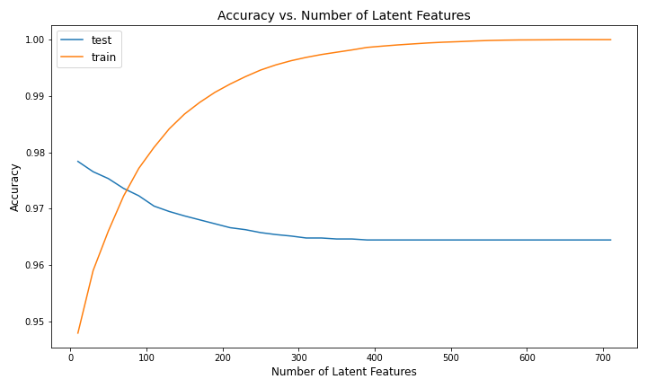

# ibm-recommdation
recommendation system based on similarity of users and article popularity

# Libraries:

- `pandas`, `matplotlib`, `numpy` with `python3.6`

# Objectives:

- given a list of user-article interaction `data/user-item-interactions.csv`, how we recommend relevance articles based on interaction of other *similar* users or the *popularity* of the article itself.
- recommend articles the new users (cold-start)

# Approach:

- Rank *similarity* based **dot product** of two users, a higher product shows a better similarity,
- Rank *popularity* of articles based on the total interaction on platform
- Use *Single Value Decomposition* from *numpy.linalg.svd* to split a *user-item* matrix to three matrices: U (users), S(sigma, latent feature) and VT (V transpose for latent feature and articles)
- SVD only works with a dense matrix, no missing value, otherwise, we need to approximate U, S, VT using *FunkSVD* algorithm 

# Results:
- the accuracy is high (>99%) but it is more likely as the antifacts of memorization, in which the matrics from SVD is optimized for a single use
- the noise when introducing more *latent feature* reduces (slightly) accuracy of *testing data*

  

# Credits:
- the framework of notebooks is prepared by [Udacity.com](udacity.com)
- StackOverflow

